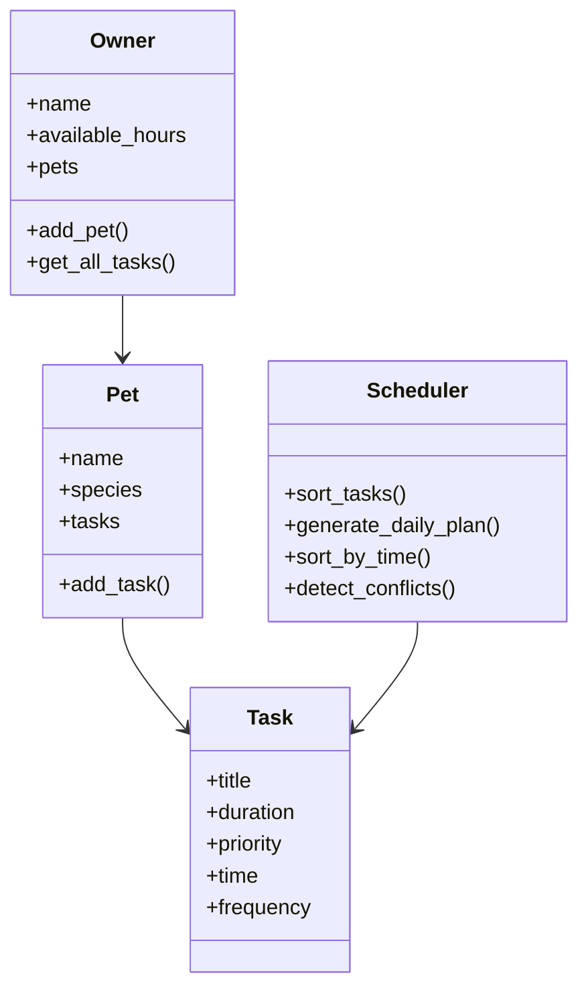

# PawPal+ Project Reflection

## 1. System Design

### a. Initial design

My initial UML design includes four main classes: Owner, Pet, Task, and Scheduler.
The Owner class is responsible for managing pets and storing information about the owner's available time. It can add pets and collect all tasks from those pets.
The Pet class represents an individual pet. It stores basic information such as name and species, and it manages a list of tasks related to that pet.
The Task class represents a single pet care activity, such as feeding or walking. Each task has a title, duration, and priority level.
The Scheduler class is responsible for organizing and generating a daily care plan. It sorts tasks by priority and selects tasks that fit within the available time.

### b. Design changes

During implementation, I kept the overall class structure the same, but I simplified the design to focus on the core scheduling logic. Instead of adding too many attributes at the beginning, I used only the fields needed for task scheduling, such as title, duration, and priority.

## 2. Scheduling Logic and Tradeoffs

### a. Constraints and priorities

My scheduler considers two main constraints: task priority and available time. Higher-priority tasks are scheduled first. A task is only added to the daily plan if it fits within the owner's available hours.

### b. Tradeoffs

One tradeoff in my scheduler is that it uses a simple priority-based strategy instead of a more advanced optimization algorithm. This means the solution is easy to understand and implement, but it may not always produce the absolute best schedule in more complex scenarios. For this project, I think that tradeoff is reasonable because the goal is to demonstrate clear object-oriented design and core scheduling logic.

One tradeoff in my scheduling system is that conflict detection only checks for tasks that start at the exact same time. It does not consider overlapping durations. This approach keeps the implementation simple and easy to understand, but it may miss more complex scheduling conflicts. For this project, I chose simplicity and clarity over completeness.

## 3. AI Collaboration

### a. How you used AI

I used AI to help brainstorm the system design, identify the main classes, and draft the initial scheduling logic. AI was also helpful for generating example UML structure and clarifying how the classes should relate to one another.

### b. Judgment and verification

I reviewed the AI-generated suggestions and simplified them to match the project requirements. I verified the result by running the demo script and checking that tasks were sorted correctly and that the daily plan respected the available time constraint.

### c. AI Strategy Reflection

Using VS Code Copilot was very helpful for quickly generating initial code structures and suggesting implementations for sorting and conflict detection. The most useful feature was inline suggestions, which helped speed up coding.

One example of modifying AI suggestions was simplifying overly complex scheduling logic. Some suggestions included unnecessary abstractions, so I adjusted them to keep the system clean and easy to understand.

Using separate chat sessions for different phases helped me stay organized. I could focus on one part of the system at a time without mixing logic, testing, and UI concerns.

Overall, I learned that while AI is powerful for generating ideas and code, human judgment is necessary to keep the design simple, correct, and aligned with project goals.

## 4. Testing and Verification

### a. What you tested

I tested task creation, the ability to add tasks to pets, task sorting by priority and time, daily plan generation, and conflict detection for tasks scheduled at the same time.

### b. Confidence

I am confident that the current version works correctly for the core use case. There is still room to improve the scheduler with more advanced logic in the future.

## 5. Reflection

### a. What went well

The object-oriented structure worked well and made the system easy to organize. The class relationships were simple and matched the real-world problem clearly.

### b. What you would improve

If I continued this project, I would add more detailed time handling, conflict detection, recurring task support, and a stronger user interface.

### c. Key takeaway

This project helped me practice turning a real-world scenario into classes, methods, and scheduling logic. I also learned how AI can help with brainstorming and implementation while still requiring human review and refinement.

## UML Diagram

